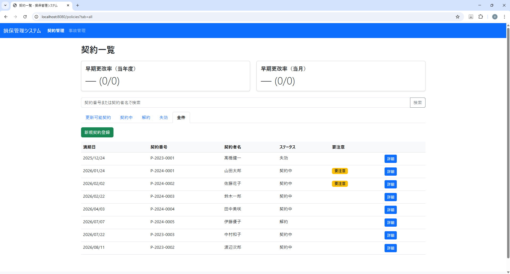
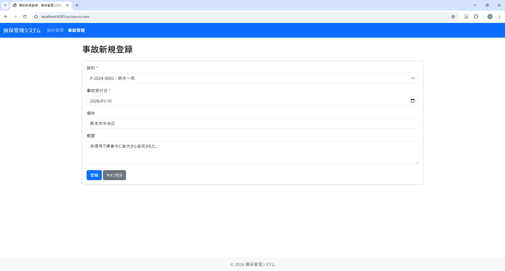
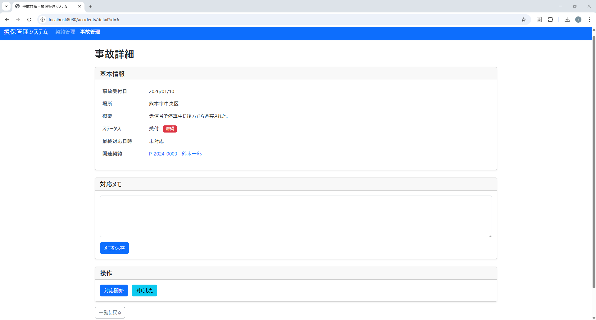
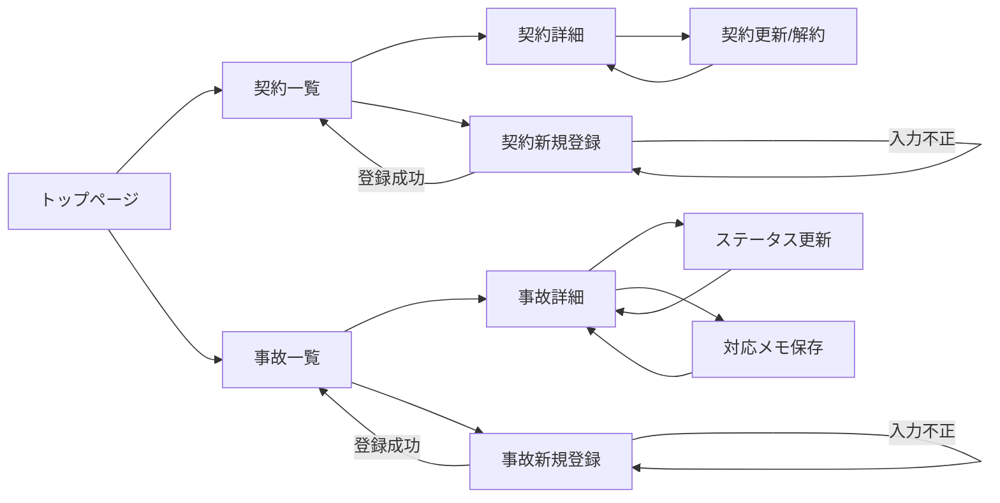

# InsuranceApp（損保アプリ：Servlet/JSP版）

**Java（Servlet/JSP）＋MySQL**で作成した学習用の損保業務題材アプリです。Webアプリの基本（画面遷移、CRUD、HTTP、ステータスコード、入力検証、例外設計、DB永続化）を一通り実装し、ポートフォリオとして提示できる状態に整備しました。

---

## 背景

損害保険代理店での実務経験を活かし、実際の業務で使用していた契約管理・事故管理システムの機能を参考に作成しました。特に早期更改率（満期日の3週間前までに更新手続きを完了した契約の割合）の向上に注力していた経験から、満期日の21日前を過ぎると契約一覧に「要注意」マークが表示される仕組みを実装しています。

また、契約一覧の上部に「早期更改率（当年度）」「早期更改率（当月）」を常時表示することで、更新業務の進捗を可視化し、業務の優先順位付けをサポートする設計としました。

---

## デモ

**動画（3分）：** 準備中（撮影予定）

> 契約・事故の一覧→詳細→登録の流れと、HTTPステータスコード（400/500）を確認できる内容です。

---

## 主な機能

### 契約管理（Policies）
- 契約一覧表示
- 契約詳細表示
- 契約新規登録
- 契約のステータス操作（更新/解約/取消）

### 事故管理（Accidents）
- 事故一覧表示
- 事故詳細表示
- 事故新規登録
- ステータス更新（未対応→対応中→完了）
- 対応日時の記録
- 対応メモの保存

### エラー設計
- **400 Bad Request**：入力不正・業務エラー（errorsを返して画面再表示）
- **500 Internal Server Error**：想定外エラー（システムエラー画面へ）

---

## 技術スタック

- **言語・フレームワーク**：Java 21 / Servlet / JSP / JSTL / EL
- **アプリケーションサーバー**：Apache Tomcat 10.1.x
- **データベース**：MySQL 9.x
- **ビルドツール**：Maven
- **バージョン管理**：Git / GitHub

---

## 画面イメージ

### 1. 契約一覧
契約番号・顧客名・満期日・ステータスを一覧表示し、検索・絞り込み・新規登録が可能です。



### 2. 事故新規登録
契約ID・発生日・場所・概要を入力して事故を登録します。入力検証により不正なデータを防ぎます。



### 3. 事故詳細（ステータス更新）
事故の詳細情報を表示し、ステータス更新（対応中→解決）や対応メモの保存が可能です。



---

## セットアップ（ローカル環境で動作確認）

### 前提

以下がインストール済みであることを確認してください。

- **Java**：JDK 21以上
- **Apache Tomcat**：10.1.x（Jakarta EE 6.0対応）
- **MySQL**：9.x
- **Maven**：3.6以上（IntelliJ IDEAの内蔵Mavenでも可）
- **IntelliJ IDEA**：日本語版推奨

---

### 手順1：リポジトリをクローン

```bash
git clone https://github.com/aki251101/InsuranceApp.git
cd InsuranceApp
```

---

### 手順2：データベースの準備

#### 2-1. MySQLにログイン

```bash
mysql -u root -p
```

#### 2-2. データベース作成とテーブル初期化

本プロジェクトには `src/main/resources/init.sql` が用意されています。このファイルを実行すると、データベース（`insurance_app`）の作成、テーブル作成、初期データ投入が一括で行われます。

**MySQL CLIで実行する場合：**

```bash
mysql -u root -p < src/main/resources/init.sql
```

**MySQL Workbenchで実行する場合：**

1. MySQL Workbenchを起動
2. `src/main/resources/init.sql` を開く
3. 実行（⚡ボタン）

#### 2-3. データベース作成の確認

```sql
USE insurance_app;
SHOW TABLES;
```

以下のテーブルが作成されていることを確認してください：
- `policies`
- `accidents`

---

### 手順3：環境変数の設定（重要）

DB接続情報は **環境変数** で注入します（コードにパスワードを直書きしない）。

#### 必要な環境変数

| 環境変数名 | 設定値（例） |
|---|---|
| `INSURANCEAPP_DB_URL` | `jdbc:mysql://localhost:3306/insurance_app?useSSL=false&serverTimezone=Asia/Tokyo&allowPublicKeyRetrieval=true` |
| `INSURANCEAPP_DB_USER` | `root` |
| `INSURANCEAPP_DB_PASSWORD` | （あなたのMySQLのパスワード） |

#### IntelliJ IDEAでの設定方法（日本語UI）

1. IntelliJ IDEA右上の実行構成（Tomcat）を選択
2. **「実行」→「構成の編集...」** を開く
3. 左側のリストから該当のTomcat構成を選択
4. **「環境変数」** の項目を探す
5. **「環境変数を渡す」** にチェックを入れる
6. 表の右側の **「＋」** ボタンを押して、上記3つの環境変数を追加
   - 名前：`INSURANCEAPP_DB_URL`、値：`jdbc:mysql://...`
   - 名前：`INSURANCEAPP_DB_USER`、値：`root`
   - 名前：`INSURANCEAPP_DB_PASSWORD`、値：（あなたのパスワード）
7. **「適用」→「OK」**

---

### 手順4：Tomcatの起動

#### 4-1. IntelliJ IDEAでの起動（推奨）

1. 右上の実行構成が **Tomcat** になっていることを確認
2. **▶ 実行** または **デバッグ（虫アイコン）** をクリック
3. ブラウザが自動で開き、Tomcatが起動します

#### 4-2. アクセスURL

Tomcatが起動したら、以下のURLにアクセスしてください。

- **トップページ**：`http://localhost:8080/`
- **契約一覧**：`http://localhost:8080/policies`
- **事故一覧**：`http://localhost:8080/accidents`

> **注：** ポート番号（8080）は、Tomcat構成で変更している場合は適宜読み替えてください。

---

### 手順5：動作確認

以下の操作を試して、正常に動作することを確認してください。

#### 5-1. 契約一覧の表示

1. `http://localhost:8080/policies` にアクセス
2. 契約データが一覧表示されることを確認

#### 5-2. 契約の新規登録

1. 契約一覧画面の **「新規登録」** ボタンをクリック
2. フォームに入力して **「登録」** をクリック
3. 一覧画面に戻り、登録した契約が表示されることを確認

#### 5-3. 事故の新規登録（入力検証の確認）

1. `http://localhost:8080/accidents` にアクセス
2. **「新規登録」** ボタンをクリック
3. **必須項目を空欄のまま** 登録ボタンを押す
4. **エラーメッセージが表示され、入力値が保持される** ことを確認（HTTPステータス：400）

#### 5-4. HTTPステータスコードの確認（重要）

ブラウザの開発者ツール（F12）で **Network** タブを開き、以下を確認してください。

- **正常登録時**：302（リダイレクト）
- **入力不正時**：400（Bad Request）
- **想定外エラー時**：500（Internal Server Error）

---

## エンドポイント一覧

### 契約（Policies）

| HTTPメソッド | URL | 説明 |
|---|---|---|
| GET | `/policies` | 契約一覧表示 |
| GET | `/policies/detail?id={id}` | 契約詳細表示 |
| GET | `/policies/new` | 契約新規登録フォーム |
| POST | `/policies/new` | 契約新規登録 |
| POST | `/policies/renew?id={id}` | 契約を更新 |
| POST | `/policies/unrenew?id={id}` | 契約更新を取消 |
| POST | `/policies/cancel?id={id}` | 契約を解約 |
| POST | `/policies/uncancel?id={id}` | 契約解約を取消 |

### 事故（Accidents）

| HTTPメソッド | URL | 説明 |
|---|---|---|
| GET | `/accidents` | 事故一覧表示 |
| GET | `/accidents/detail?id={id}` | 事故詳細表示 |
| GET | `/accidents/new` | 事故新規登録フォーム |
| POST | `/accidents/new` | 事故新規登録 |
| POST | `/accidents/status?id={id}&status={status}` | ステータス変更 |
| POST | `/accidents/contacted?id={id}` | 対応日時更新 |
| POST | `/accidents/memo?id={id}&memo={memo}` | メモ保存 |

---

## データベース設計

### テーブル構成

#### policies（契約）

| カラム名 | 型 | 説明 |
|---|---|---|
| id | BIGINT | 主キー（自動採番） |
| policy_number | VARCHAR(30) | 契約番号（ユニーク制約） |
| customer_name | VARCHAR(100) | 顧客名 |
| start_date | DATE | 契約開始日 |
| end_date | DATE | 満期日 |
| status | VARCHAR(20) | ステータス（ACTIVE/RENEWED/CANCELLED） |
| renewal_due_end_date | DATE | 早期更改期限日（満期日の21日前を自動計算） |
| renewed_at | DATETIME | 更新日時 |
| cancelled_at | DATETIME | 解約日時 |
| created_at | DATETIME | 作成日時 |
| updated_at | DATETIME | 更新日時 |

**インデックス：**
- `idx_end_date`：満期日での検索を高速化
- `idx_customer_name`：顧客名での検索を高速化

#### accidents（事故）

| カラム名 | 型 | 説明 |
|---|---|---|
| id | BIGINT | 主キー（自動採番） |
| policy_id | BIGINT | 契約ID（外部キー：policies.id） |
| occurred_at | DATE | 事故発生日 |
| place | VARCHAR(200) | 発生場所 |
| description | TEXT | 事故詳細 |
| status | VARCHAR(20) | ステータス（PENDING/IN_PROGRESS/RESOLVED） |
| last_contacted_at | DATETIME | 最終対応日時 |
| memo | TEXT | 対応メモ |
| created_at | DATETIME | 作成日時 |
| updated_at | DATETIME | 更新日時 |

**インデックス：**
- `idx_policy_id`：契約IDでの検索を高速化
- `idx_status`：ステータスでの絞り込みを高速化

---

## 画面遷移



**主要な画面遷移の説明：**
- **契約一覧 → 契約新規登録 → 契約一覧**：POST/Redirect/Getパターンで二重送信を防止
- **事故一覧 → 事故新規登録 → 事故一覧**：同様にPRGパターン
- **契約詳細 → 契約更新/解約 → 契約詳細**：ステータス変更後、同じ詳細画面に戻る
- **事故詳細 → ステータス更新/メモ保存 → 事故詳細**：POSTで更新後、GETで再表示

---

## テスト観点（HTTPステータスコード検証）

本プロジェクトでは、ブラウザの画面表示だけでなく、**NetworkタブでHTTPステータスを確認**して品質を担保しています。

### 400（入力不正）

以下のケースで **400 Bad Request** が返ることを確認しています。

- 必須項目の不足（policyId、occurredAt など）
- 形式不正（policyIdが数値に変換できない、日付がparseできない）
- 範囲不正（policyId <= 0、place 100文字超、description 500文字超）

**期待される動作：**
- HTTPステータス：**400**
- `errors` がリクエストスコープに設定され、画面にエラーメッセージが表示される
- 入力値が保持されて再表示される

### 500（想定外エラー）

想定外の例外が発生した場合、**500 Internal Server Error** が返ります。

**期待される動作：**
- HTTPステータス：**500**
- ユーザーには「システムエラー」メッセージが表示される

### 確認手順（ブラウザ）

1. Chrome DevToolsを開く（F12）
2. **Network** タブを選択
3. 登録ボタンを押下して、`POST` リクエストが発生することを確認
4. `Status Code` を確認（400/500/302 など）

> **注：** 画面上の遷移（リダイレクト）により、表示とNetworkの最終ステータスが一致しない場合があるため、Networkでの確認を重視しています。

---

## ディレクトリ構成

```
InsuranceApp/
├── src/
│   ├── main/
│   │   ├── java/
│   │   │   └── jp/insurance/system/
│   │   │       ├── controller/     # Servlet（画面制御）
│   │   │       ├── service/        # 業務処理
│   │   │       ├── dao/            # DBアクセス
│   │   │       ├── model/          # ドメインモデル・DTO
│   │   │       ├── exception/      # 例外クラス
│   │   │       └── util/           # DB接続・日付ユーティリティ
│   │   ├── resources/
│   │   │   └── init.sql            # DB初期化スクリプト
│   │   └── webapp/
│   │       ├── WEB-INF/
│   │       │   ├── views/          # JSPファイル
│   │       │   └── web.xml         # Servlet設定
│   │       ├── css/                # スタイルシート
│   │       └── index.jsp           # トップページ
│   └── test/                       # テストコード（今後拡張予定）
├── pom.xml                         # Maven設定
└── README.md                       # このファイル
```

---

## 設計・実装上の工夫

### 1. 入力検証をServlet側で実装
JSPの `required` 属性は補助的に使用し、主な検証はServlet側で実施しています。これにより、以下を実現しています。

- クライアント側の改ざんに対応
- 一貫した検証ロジック
- エラーメッセージの柔軟な制御

### 2. HTTPステータスコードの適切な使用
- **400 Bad Request**：入力不正・業務エラー（errorsを返して画面再表示）
- **500 Internal Server Error**：想定外エラー（システムエラー画面へ）

業務例外（`BusinessException`）は **400** に寄せて扱い、予期しない例外は **500** として扱っています。

### 3. 環境変数によるDB接続情報の分離
DB接続情報（特にパスワード）を環境変数で注入することで、以下を実現しています。

- GitHubに機密情報をコミットしない
- ローカル環境と本番環境で設定を切り替えやすい

### 4. POST/Redirectパターンの採用
登録・更新・削除などの操作は **POST** で実行し、成功後は **GET** にリダイレクトすることで、ブラウザの「戻る」ボタンやリロード時の二重送信を防止しています。

### 5. NetworkでHTTPステータスを検証
画面上の表示だけでなく、ブラウザの開発者ツール（Networkタブ）でHTTPステータスコードを確認することで、品質を担保しています。

---

## セキュリティ・公開に関する注意

- **DBパスワードなどの秘密情報は環境変数に分離**
- **Git履歴から機密文字列を除去済み**（`git filter-repo` 実施）
- **公開時は `.idea/`, `target/` など不要物を除外**（`.gitignore`で管理）

---

## 今後の拡張（例）

- Docker Composeによるワンコマンド起動（MySQL + Tomcat）
- 画面UI改善（入力補助・エラーデザイン）
- テストコード（単体・結合）の整備
- 外部連携版（カレンダー、通知、生成AI、クラウド）への段階的な接続

---

## 連絡先

- **GitHub**：https://github.com/aki251101

---

## ライセンス

このプロジェクトは学習目的で作成されたものです。商用利用は想定していません。

---

> **採用担当者向け：** デモ動画URLと本READMEの起動手順により、動作確認と実装理解がしやすい構成にしています。ご不明点がありましたら、お気軽にお問い合わせください。
