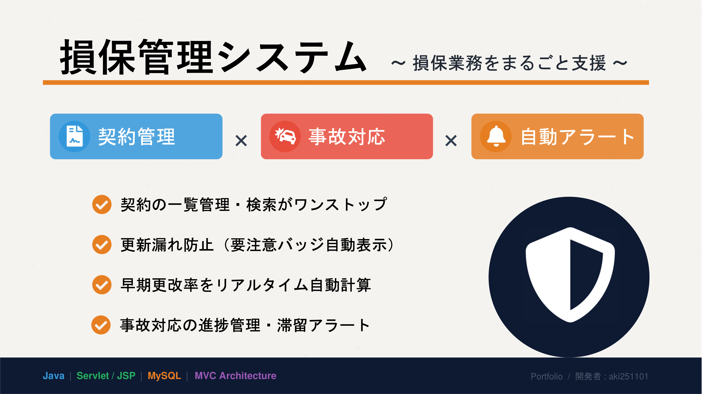
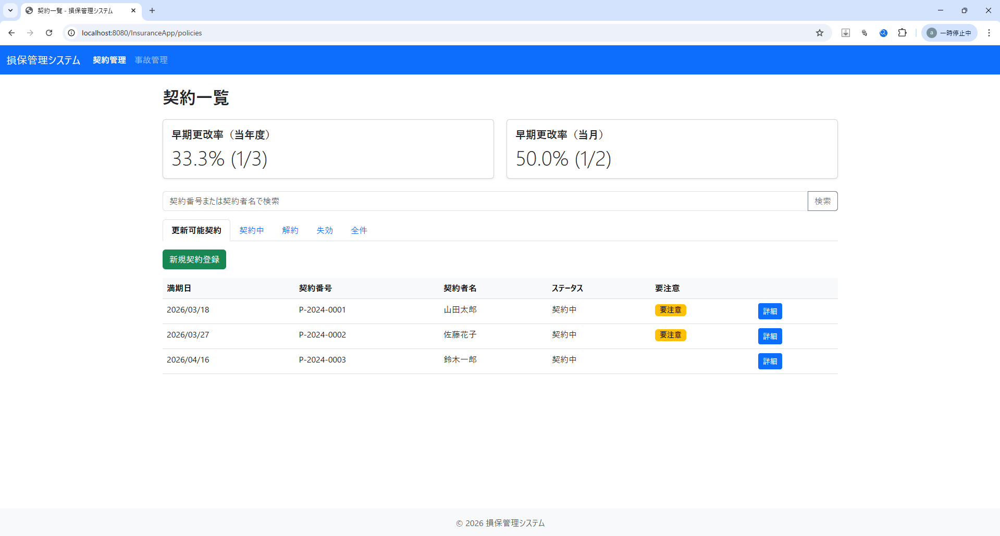
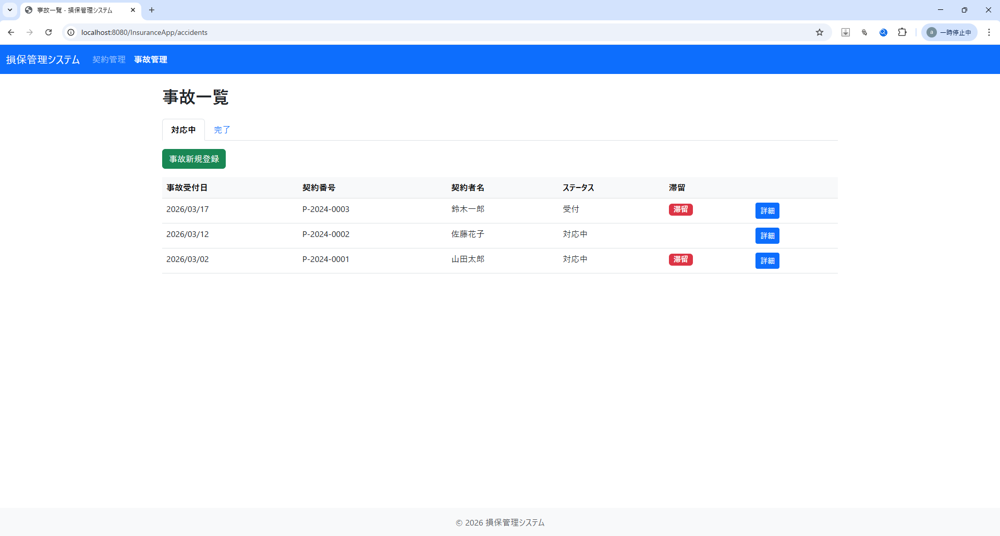
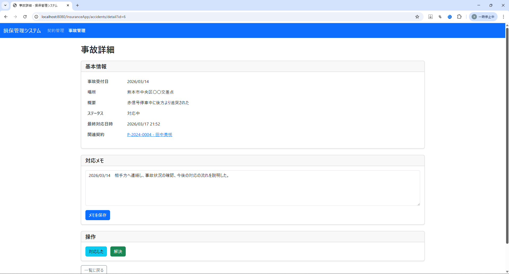

# 損保管理システム - Servlet / JSP版

自動車保険の契約管理と事故対応を支援するWebアプリケーションです。  
保険代理店の日常業務で発生する**契約の更新漏れ**や**事故対応の滞留**を防ぐことを目的としています。



📄 **1枚で分かる概要スライド（PDF）**  
👉 [PDFを開く](./doc/portfolio/overview_slide.pdf)

🎬 **デモ動画（2分40秒 / Google Drive）**  
👉 [デモ動画を見る](https://drive.google.com/file/d/1cQv2cGKbgXoXj7quMJeEL1iR_Pe6H1DG/view?usp=sharing)

---

## README 1行要約
**保険代理店の現場経験から生まれた、契約更新管理と事故対応進捗管理を一体化した Servlet/JSP 製の業務支援 Web アプリ。**

---

## 📋 目次
- [概要](#概要)
- [主な機能](#主な機能)
- [スクリーンショット](#スクリーンショット)
- [技術スタック](#技術スタック)
- [プロジェクト構成](#プロジェクト構成)
- [セットアップ手順](#セットアップ手順)
- [基本的な使い方](#基本的な使い方)
- [コンテナの操作](#コンテナの操作)
- [DB 初期化について](#db-初期化について)
- [環境変数](#環境変数)
- [画面一覧](#画面一覧)
- [設計方針](#設計方針)
- [ドキュメント](#ドキュメント)
- [このアプリを作った背景](#このアプリを作った背景)

---

## 📖 概要
**損保管理システム**は、Servlet/JSPで構築した自動車保険向けの業務支援Webアプリです。
契約管理と事故管理を一体化し、**更新漏れ・対応漏れの防止**を目的としています。
早期更改率の可視化と注意/滞留マークにより、現場の優先対応判断を支援します。

### 特徴
- ✅ 契約管理と事故管理を1つの画面群で運用できる（一覧・詳細・新規登録・状態更新）
- ✅ 早期更改率（当年度/当月）を集計表示し、更新活動の進捗を定量的に確認できる
- ✅ 契約一覧で「要注意」（満期20日前〜満期日）、事故一覧で「滞留」（最終対応から7日以上または未対応）を表示
- ✅ Servlet/JSP（MVC）構成で実装し、業務ルールをService層で管理して保守しやすい

### 想定ユーザー
- 保険代理店で契約更新・満期管理を担当する事務スタッフ
- 事故受付後の進捗管理・顧客対応を行う担当者
- 早期更改率や滞留状況を確認し、業務改善を行う管理者
- 社内業務システムの運用・改修を担当する開発者

---

## ✨ 主な機能

### 契約管理
- 契約一覧の表示（タブ切り替え：更新可能契約 / 契約中 / 解約 / 失効 / 全件）
- 契約番号による検索、契約者名による検索
- 契約の新規登録（契約番号は年度ごとに自動採番、満期日は開始日から1年後を自動計算）
- 契約の更新（満期2か月前〜満期日の期間に実行可能）
- 契約の更新取消（当日限定）
- 契約の解約 / 解約取消（当日限定）
- 早期更改率の集計表示（当年度 / 当月）
- 要注意バッジ（満期20日前〜満期日の契約に表示）

### 事故管理
- 事故一覧の表示（タブ切り替え：対応中 / 完了）
- 事故の新規登録（契約を選択して登録）
- ステータス管理（受付 → 対応中 → 完了、完了からは戻せない）
- 「対応した」ボタンで最終対応日時を記録
- 対応メモの保存
- 滞留バッジ（最終対応から7日以上経過、または未対応の事故に表示）

---

## 📸 スクリーンショット

### 契約一覧


### 事故一覧


### 事故詳細


---

## 🧰 技術スタック

| 項目 | 内容 |
|------|------|
| 言語 | Java 17 |
| サーバー | Apache Tomcat 10.1.x |
| フレームワーク | Servlet 6.0 / JSP 3.1（フレームワークなし） |
| データベース | MySQL 8.x |
| ビルドツール | Maven |
| CSS | Bootstrap 5 |
| ログ | SLF4J + Logback |
| 実行環境 | Docker / Docker Compose |

### 主な依存ライブラリ

| ライブラリ | バージョン | 用途 |
|-----------|-----------|------|
| jakarta.servlet-api | 6.0.0 | Servlet API |
| jakarta.servlet.jsp-api | 3.1.1 | JSP API |
| jakarta.servlet.jsp.jstl-api | 3.0.0 | JSTL API |
| mysql-connector-j | 8.2.0 | MySQL接続 |
| slf4j-api | 2.0.9 | ログAPI |
| logback-classic | 1.4.14 | ログ実装 |

---

## 📁 プロジェクト構成

```
src/main/
├── java/jp/insurance/system/
│   ├── controller/          ← Servlet（画面の入口）
│   │   ├── PolicyListServlet.java
│   │   ├── PolicyDetailServlet.java
│   │   ├── PolicyNewServlet.java
│   │   ├── PolicyActionServlet.java
│   │   ├── AccidentListServlet.java
│   │   ├── AccidentDetailServlet.java
│   │   ├── AccidentNewServlet.java
│   │   └── AccidentActionServlet.java
│   ├── service/             ← 業務ロジック
│   │   ├── PolicyService.java
│   │   ├── AccidentService.java
│   │   └── StatsService.java
│   ├── dao/                 ← データベースアクセス
│   │   ├── PolicyDao.java
│   │   └── AccidentDao.java
│   ├── model/               ← データの入れ物
│   │   ├── Policy.java
│   │   ├── PolicyStatus.java
│   │   ├── Accident.java
│   │   ├── AccidentStatus.java
│   │   └── RenewalStats.java
│   ├── exception/           ← 例外クラス
│   │   ├── BusinessException.java
│   │   └── SystemException.java
│   └── util/                ← 共通ユーティリティ
│       ├── Db.java
│       ├── DateUtil.java
│       └── DataInitializer.java
├── resources/
│   └── init.sql             ← テーブル作成・初期データ投入SQL
└── webapp/
    ├── index.jsp
    ├── css/style.css
    └── WEB-INF/
        ├── web.xml
        └── views/
            ├── policy/      ← 契約画面
            │   ├── list.jsp
            │   ├── detail.jsp
            │   └── new.jsp
            ├── accident/    ← 事故画面
            │   ├── list.jsp
            │   ├── detail.jsp
            │   └── new.jsp
            └── common/      ← 共通部品
                ├── header.jsp
                ├── footer.jsp
                └── notFound.jsp
```

### Docker 関連ファイル

```
プロジェクトルート/
├── Dockerfile
├── docker-compose.yml
├── .dockerignore
└── .env.example             ← 環境変数のテンプレート
```

---

## 🚀 セットアップ手順

### 前提条件
- Docker Desktop（または Docker Engine + Docker Compose）が使えること

### 1. 環境変数ファイルの準備

プロジェクトルートで `.env` を作成します。

```bash
cp .env.example .env
```

PowerShell の場合:

```powershell
Copy-Item .env.example .env
```

`.env` の `MYSQL_ROOT_PASSWORD` を必ず変更してください。

### 2. コンテナの起動

```bash
docker compose up --build -d
```

### 3. アクセス確認

ブラウザで以下にアクセスしてください。

```
http://localhost:8080/InsuranceApp/
```

---

## 🖥️ 基本的な使い方

起動後は `http://localhost:8080/InsuranceApp/` にアクセスして操作できます。

**契約管理の基本フロー**
1. 「契約一覧」画面で契約を確認（要注意バッジで満期が近い契約を把握）
2. 「新規登録」から新しい契約を登録
3. 契約詳細画面から更新・解約などの操作を実行

**事故管理の基本フロー**
1. 「事故一覧」画面で対応状況を確認（滞留バッジで対応が遅れている案件を把握）
2. 「新規登録」から事故を登録（契約を選択して紐付け）
3. 事故詳細画面でステータス更新・対応メモを記録

📄 詳細な操作手順は [操作ガイド（PDF）](./doc/design/user_guide_v1.pdf) を参照してください。

---

## 🐳 コンテナの操作

| 操作 | コマンド |
|------|----------|
| 停止 | `docker compose down` |
| データを含めて削除 | `docker compose down -v` |
| アプリのログ確認 | `docker compose logs -f app` |
| DBのログ確認 | `docker compose logs -f db` |

---

## 🗄️ DB 初期化について

- `src/main/resources/init.sql` を MySQL コンテナ起動時に自動実行します。
- 初回起動時のみ実行されます（`db_data` ボリュームが空の場合）。
- 再初期化したい場合は `docker compose down -v` 実行後に再起動してください。

---

## ⚙️ 環境変数

### `.env`（Compose 用）

| 変数名 | デフォルト値 | 説明 |
|--------|------------|------|
| `APP_PORT` | `8080` | アプリ公開ポート |
| `DB_PORT` | `3306` | DB公開ポート |
| `MYSQL_DATABASE` | `insurance_app` | DB名 |
| `MYSQL_ROOT_PASSWORD` | （必須・要変更） | MySQL root パスワード |
| `TZ` | `Asia/Tokyo` | タイムゾーン |

### app コンテナ（Db.java が参照）

| 変数名 | 値 |
|--------|-----|
| `INSURANCEAPP_DB_HOST` | `db` |
| `INSURANCEAPP_DB_PORT` | `3306` |
| `INSURANCEAPP_DB_NAME` | `${MYSQL_DATABASE}` |
| `INSURANCEAPP_DB_USER` | `root` |
| `INSURANCEAPP_DB_PASSWORD` | `${MYSQL_ROOT_PASSWORD}` |

---

## 📸 画面一覧

| 画面 | URL | 説明 |
|------|-----|------|
| トップ | `/` | 契約一覧へリダイレクト |
| 契約一覧 | `/policies` | タブ切り替え・検索・集計表示 |
| 契約詳細 | `/policies/detail?id={id}` | 更新・解約などの操作 |
| 契約新規登録 | `/policies/new` | 契約者名と開始日を入力して登録 |
| 事故一覧 | `/accidents` | 対応中・完了のタブ切り替え |
| 事故詳細 | `/accidents/detail?id={id}` | ステータス変更・メモ保存 |
| 事故新規登録 | `/accidents/new` | 契約を選択して事故を登録 |

---

## 🏗️ 設計方針

### アーキテクチャ
フレームワークを使わず、Servlet/JSPで基本的なMVCパターンを実装しています。

- **Controller（Servlet）**: リクエストの受付、パラメータ取得、Serviceの呼び出し、画面遷移
- **Service**: 業務ルールのチェック、トランザクション管理
- **DAO**: SQLの実行、ResultSetからModelへの変換
- **Model**: データの入れ物（Policy、Accidentなど）
- **View（JSP）**: 画面表示

### 例外処理
- **BusinessException**: 業務ルール違反（ユーザーにメッセージを表示）
- **SystemException**: DB接続エラーなどの想定外エラー

### ログ
- 重要な操作（更新・解約・ステータス変更など）をINFOレベルで記録
- 業務ルール違反をWARNレベルで記録
- DB例外をERRORレベルで記録
- 個人情報（氏名）はログに出さず、IDのみ記録

---

## 📚 ドキュメント
- [📄 操作ガイド（user_guide_v1.pdf）](./doc/design/user_guide_v1.pdf)
- [📄 1枚資料（overview_slide.pdf）](./doc/portfolio/overview_slide.pdf)

---

## 💡 このアプリを作った背景

損害保険代理店として13年間働いた経験から、日常業務で特に重要だった「契約更新の管理」と「事故対応の進捗管理」をWebアプリとして実装しました。早期更改期間（更新手続き可能な満期日2か月前から3週間前まで）での更新を保険会社から推奨されていたため、満期日の3週間前を過ぎた契約は契約一覧画面に「要注意」と表示するようにしました。また、事故一覧画面では、前回の対応から1週間過ぎると「滞留」と表示するようにしました。この2点により契約更新漏れ、事故対応漏れを防ぐ仕組みを作りました。
